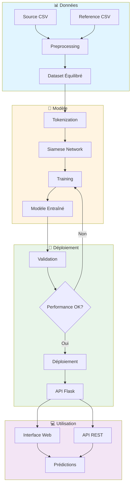
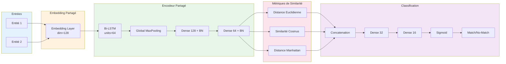

# 🔍 Entity Resolution MLOps

<div align="center">


**Système intelligent de résolution d'entités utilisant un réseau de neurones siamois avec pipeline MLOps complet**

[Installation](#-installation) • [Utilisation](#-utilisation) • [Architecture](#-architecture) • [API](#-api) • [MLOps](#-mlops)

</div>

---

## 📋 Table des matières

- [À propos](#-à-propos)
- [Fonctionnalités](#-fonctionnalités)
- [Architecture du projet](#-architecture-du-projet)
- [Architecture du modèle](#-architecture-du-modèle)
- [Installation](#-installation)
- [Utilisation](#-utilisation)
- [API REST](#-api-rest)
- [Pipeline MLOps](#-pipeline-mlops)
- [Docker & Déploiement](#-docker--déploiement)
- [Résultats](#-résultats)
- [Technologies utilisées](#-technologies-utilisées)
- [Contribuer](#-contribuer)

---

## 🎯 À propos

Ce projet implémente une solution MLOps complète pour la **résolution d'entités** (Entity Resolution) en utilisant un **Réseau de Neurones Siamois** (Siamese Neural Network). Il permet d'identifier si deux entités (personnes, organisations, etc.) représentent la même entité réelle malgré des variations dans leur représentation textuelle.

### Cas d'usage

- ✅ Déduplication de bases de données clients
- ✅ Correspondance d'identités entre systèmes
- ✅ Détection de doublons dans les enregistrements
- ✅ Vérification d'identité automatisée
- ✅ Fusion de données multi-sources

---

## ✨ Fonctionnalités

### 🤖 Machine Learning

- **Réseau Siamois Bidirectionnel LSTM** avec couches d'attention
- **Métriques de similarité multiples** : Distance euclidienne, similarité cosinus, distance de Manhattan
- **Preprocessing avancé** avec tokenisation et normalisation de texte
- **Gestion du déséquilibre des classes** avec génération intelligente de paires négatives

### 🌐 Application Web

- **Interface utilisateur intuitive** avec Flask
- **3 modes de prédiction** :
  - Comparaison simple (paire unique)
  - Traitement par lot (batch)
  - Recherche en base de données
- **API REST complète** avec documentation JSON

### 🔄 Pipeline MLOps

- **Pipeline Kubeflow** complet pour l'entraînement et le déploiement
- **Containerisation Docker** pour portabilité
---

## 🏗️ Architecture du projet



---

## 🧠 Architecture du modèle

### Réseau Siamois

Le modèle utilise une architecture siamoise avec des poids partagés pour encoder les deux entités :



### Couches Personnalisées

Le modèle inclut trois couches custom TensorFlow pour calculer les similarités :

1. **EuclideanDistanceLayer** : `√Σ(xi - yi)²`
2. **CosineSimilarityLayer** : `(x·y) / (||x|| ||y||)`
3. **ManhattanDistanceLayer** : `Σ|xi - yi|`

---

## 📦 Installation

### Prérequis

- Python 3.9+
- pip
- (Optionnel) Docker
- (Optionnel) Kubernetes cluster avec Kubeflow

### Installation locale

```bash
# Cloner le repository
git clone https://github.com/mounirlamsayah/Entity_Resolution_MLOps.git
cd Entity_Resolution_MLOps

# Créer un environnement virtuel
python -m venv env
source env/bin/activate  # Linux/Mac
# ou
env\Scripts\activate  # Windows

# Installer les dépendances
pip install -r requirements.txt
```

### Installation avec Docker

```bash
# Construire l'image
docker build -f docker/Dockerfile -t entity-matcher:latest .

# Ou utiliser docker-compose
docker-compose -f docker/docker-compose.yaml up
```

---

## 🚀 Utilisation

### 1️⃣ Préparation des données

Placez vos fichiers CSV dans le dossier `data/` :
- `source_final.csv` : données source
- `reference_final.csv` : données de référence

```bash
python src/data_preprocessing.py
```

**Sorties** :
- `models/X1_train.npy`, `X2_train.npy`, `y_train.npy` : données d'entraînement
- `models/X1_test.npy`, `X2_test.npy`, `y_test.npy` : données de test
- `models/tokenizer.pkl` : tokenizer sauvegardé
- `models/processed_dataset.csv` : dataset complet

### 2️⃣ Entraînement du modèle

```bash
python src/model_training.py
```

**Sorties** :
- `models/siamese_entity_matcher.h5` : modèle entraîné
- `models/best_model.h5` : meilleur modèle (early stopping)
- `models/training_metrics.json` : métriques d'entraînement
- `models/training_history.png` : courbes d'apprentissage

### 3️⃣ Lancement de l'application

```bash
python src/app.py
```

Accédez à l'interface web : **http://localhost:5000**

---

## 🌐 API REST

### Endpoints disponibles

#### 1. Prédiction simple

```bash
POST /api/predict
Content-Type: application/json

{
  "text1": "Jean Dupont 123 rue de la Paix Paris CIN123456",
  "text2": "DUPONT Jean 123 RUE PAIX PARIS CIN123456"
}
```

**Réponse** :
```json
{
  "text1": "Jean Dupont 123 rue de la Paix Paris CIN123456",
  "text2": "DUPONT Jean 123 RUE PAIX PARIS CIN123456",
  "similarity_score": 0.9234,
  "is_match": true,
  "confidence": "High",
  "timestamp": "2025-10-05T14:30:00"
}
```

#### 2. Prédiction par lot

```bash
POST /api/batch_predict
Content-Type: application/json

{
  "pairs": [
    {"text1": "Entity A1", "text2": "Entity A2"},
    {"text1": "Entity B1", "text2": "Entity B2"}
  ]
}
```

#### 3. Recherche en base

```bash
POST /api/match_entity
Content-Type: application/json

{
  "query_entity": "Jean Dupont Paris",
  "database_entities": ["DUPONT Jean", "Pierre Martin", "Marie Dubois"],
  "threshold": 0.5
}
```

#### 4. Évaluation du modèle

```bash
POST /api/evaluate
Content-Type: application/json

{
  "test_data_path": "models/processed_dataset.csv"
}
```

#### 5. Health check

```bash
GET /health
```

# 🔄 Pipeline MLOps

## 🚀 Kubeflow Pipeline

Le projet inclut un pipeline **Kubeflow** quasi-complet avec **5 composants implémentés**.

> 📝 **Note :** En raison de contraintes de ressources informatiques, je n'ai pas pu accéder à une interface Kubeflow déployée pour tester le pipeline en conditions réelles.  
> Cependant, **le code du pipeline est entièrement développé** et il ne reste qu'une petite partie de finalisation pour le rendre **100% opérationnel** en production.  
> Le pipeline peut être compilé et est prêt pour être déployé sur un cluster Kubeflow fonctionnel.

---

```mermaid
graph LR
    A[1. Data<br/>Preprocessing] --> B[2. Model<br/>Training]
    B --> C[3. Model<br/>Evaluation]
    C --> D[4. Model<br/>Validation]
    D --> E[5. Model<br/>Deployment]
    
    style A fill:#e3f2fd
    style B fill:#fff3e0
    style C fill:#e8f5e9
    style D fill:#fce4ec
    style E fill:#f3e5f5

## 📦 État du pipeline

| Composant          | Statut       | Description                          |
| ------------------ | ------------ | ------------------------------------ |
| Data Preprocessing | ✅ Implémenté | Chargement et traitement des données |
| Model Training     | ✅ Implémenté | Entraînement du réseau siamois       |
| Model Evaluation   | ✅ Implémenté | Évaluation sur jeu de test           |
| Model Validation   | ✅ Implémenté | Validation selon seuils définis      |
| Model Deployment   | 🔄 En cours  | Déploiement conditionnel du modèle   |

## ⚙️ Compiler le pipeline

# Compiler le pipeline en fichier YAML
python kubeflow/pipeline.py

# Génère deux fichiers :
# - entity_matching_pipeline.yaml (pipeline principal)
# - entity_matching_retrain_pipeline.yaml (pipeline de retraining)

##▶️ Exécution du pipeline (quand Kubeflow disponible)

### Via l’interface Kubeflow UI

1. Se connecter à l'interface Kubeflow
2. Uploader le fichier entity_matching_pipeline.yaml
3. Créer une expérience "entity-matching"
4. Lancer un run avec les paramètres souhaités

## 🔧 Paramètres du pipeline

| Paramètre     | Description                    | Défaut               |
| ------------- | ------------------------------ | -------------------- |
| epochs        | Nombre d'époques               | 10                   |
| batch_size    | Taille du batch                | 32                   |
| learning_rate | Taux d'apprentissage           | 0.001                |
| min_accuracy  | Seuil de validation (accuracy) | 0.7                  |
| min_f1        | Seuil de validation (F1-score) | 0.7                  |
| model_name    | Nom du modèle                  | entity-matcher-model |
| model_version | Version du modèle              | v1                   |

## 🔁 Pipeline de Retraining

Un second pipeline est disponible pour le fine-tuning avec de nouvelles données :

# Compiler le pipeline de retraining
python kubeflow/pipeline.py

Ce pipeline utilise :

  - Un learning rate plus faible (0.0001)

  - Moins d'époques (5)

  - Seuils de validation plus élevés (0.75)

## 🐳 Docker & Déploiement

Docker Compose

# Lancer l'API
docker-compose -f docker/docker-compose.yaml up api

# Exécuter le preprocessing
docker-compose -f docker/docker-compose.yaml up preprocess

# Exécuter l'entraînement
docker-compose -f docker/docker-compose.yaml up train


## 🌍 Variables d'environnement

MODEL_PATH=/app/models
DATA_PATH=/app/data
FLASK_RUN_PORT=5000
PYTHONUNBUFFERED=1

## 💾 Volumes persistants

-   ./models:/app/models → modèles entraînés

-   ./data:/app/data → données source

-   ./logs:/app/logs → logs d'exécution

## 📊 Résultats

| Métrique  | Score   |
| --------- | ------- |
| Accuracy  | ~85–90% |
| Precision | ~87–92% |
| Recall    | ~83–88% |
| F1-Score  | ~85–90% |


## 🛠️ Technologies utilisées

### Machine Learning & Deep Learning
- **TensorFlow 2.13** - Framework ML
- **Keras** - API haut niveau
- **scikit-learn** - Métriques et preprocessing
- **NumPy & Pandas** - Manipulation de données

### NLP & Text Processing
- **RapidFuzz** - Similarité de chaînes
- **Tokenizer Keras** - Tokenisation

### Web & API
- **Flask 2.3** - Framework web
- **RESTful API** - Architecture API

### MLOps & DevOps
- **Kubeflow 2.0** - Pipeline ML
- **Docker** - Containerisation
- **Kubernetes** - Orchestration

### Visualisation
- **Matplotlib & Seaborn** - Graphiques

---

## 🤝 Contribuer

Les contributions sont les bienvenues ! Voici comment participer :

1. **Fork** le projet
2. **Créer** une branche feature (`git checkout -b feature/AmazingFeature`)
3. **Commit** vos changements (`git commit -m 'Add AmazingFeature'`)
4. **Push** vers la branche (`git push origin feature/AmazingFeature`)
5. **Ouvrir** une Pull Request

### Guidelines

- Suivre le style de code existant
- Ajouter des tests pour les nouvelles fonctionnalités
- Mettre à jour la documentation
- S'assurer que tous les tests passent

---

## 📝 Roadmap

- [ ] Ajouter le support des embeddings pré-entraînés (BERT, GPT)
- [ ] Implémenter un système de cache pour les prédictions
- [ ] Ajouter des métriques de monitoring Prometheus
- [ ] Support multi-langues
- [ ] Interface CLI pour batch processing
- [ ] Intégration avec Airflow pour orchestration

---

## 🐛 Issues connues

Consultez la [page des issues](https://github.com/mounirlamsayah/Entity_Resolution_MLOps/issues) pour les problèmes connus et les demandes de fonctionnalités.

---


## 👤 Auteur

**Mounir Lamsayah**

- Email: mounirlamssiyah@gmail.com
- GitHub: [@mounirlamsayah](https://github.com/mounirlamsayah)
- LinkedIn: [Mounir Lamsayah](https://linkedin.com/in/mounir-lamsayah)

---


## 📚 Références

- [Siamese Neural Networks for One-shot Image Recognition](https://www.cs.cmu.edu/~rsalakhu/papers/oneshot1.pdf)
- [Learning Text Similarity with Siamese Recurrent Networks](https://aclanthology.org/W16-1617.pdf)
- [Entity Resolution in Practice](https://dl.acm.org/doi/10.1145/3442381.3449951)

---

<div align="center">

**⭐ Si ce projet vous a été utile, n'hésitez pas à lui donner une étoile ! ⭐**

Made with ❤️ by Mounir Lamsayah

</div>
