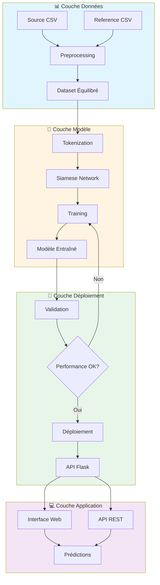
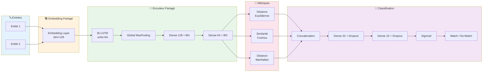
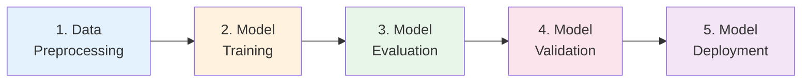

# 🔍 Entity Resolution MLOps

<div align="center">


**Système intelligent de résolution d'entités utilisant un réseau de neurones siamois avec pipeline MLOps complet**

[Installation](#-installation) • [Démarrage rapide](#-démarrage-rapide) • [Architecture](#-architecture) • [API](#-api-rest) • [MLOps](#-pipeline-mlops)

</div>

---

## 📋 Table des matières

- [À propos](#-à-propos)
- [Fonctionnalités principales](#-fonctionnalités-principales)
- [Architecture](#-architecture)
  - [Vue d'ensemble du système](#vue-densemble-du-système)
  - [Architecture du modèle](#architecture-du-modèle-siamois)
- [Installation](#-installation)
- [Démarrage rapide](#-démarrage-rapide)
- [Utilisation détaillée](#-utilisation-détaillée)
- [API REST](#-api-rest)
- [Pipeline MLOps](#-pipeline-mlops)
- [Docker & Déploiement](#-docker--déploiement)
- [Résultats](#-résultats)
- [Technologies](#-technologies-utilisées)
- [Roadmap](#-roadmap)
- [Contribution](#-contribuer)
- [Licence](#-licence)
- [Contact](#-auteur)

---

## 🎯 À propos

Ce projet implémente une **solution MLOps complète** pour la résolution d'entités (Entity Resolution) en utilisant un **Réseau de Neurones Siamois** (Siamese Neural Network). Le système permet d'identifier si deux entités (personnes, organisations, etc.) représentent la même entité réelle malgré des variations dans leur représentation textuelle.

### 🎪 Cas d'usage

| Domaine | Application |
|---------|-------------|
| 🏢 **Business** | Déduplication de bases de données clients |
| 🔗 **Intégration** | Correspondance d'identités entre systèmes |
| 🗂️ **Data Quality** | Détection de doublons dans les enregistrements |
| 🛡️ **Sécurité** | Vérification d'identité automatisée |
| 🔄 **ETL** | Fusion de données multi-sources |

---

## ✨ Fonctionnalités principales

### 🤖 Machine Learning

- ✅ **Réseau Siamois Bidirectionnel LSTM** avec couches d'attention
- ✅ **Métriques de similarité multiples** : Distance euclidienne, similarité cosinus, distance de Manhattan
- ✅ **Preprocessing avancé** avec tokenisation et normalisation de texte
- ✅ **Gestion du déséquilibre des classes** avec génération intelligente de paires négatives
- ✅ **Early stopping & Model checkpointing** pour l'optimisation

### 🌐 Application Web

- ✅ **Interface utilisateur intuitive** avec Flask
- ✅ **3 modes de prédiction** :
  - Comparaison simple (paire unique)
  - Traitement par lot (batch processing)
  - Recherche en base de données
- ✅ **API REST complète** avec documentation JSON
- ✅ **Monitoring en temps réel** des prédictions

### 🔄 MLOps & DevOps

- ✅ **Pipeline Kubeflow** pour l'entraînement et le déploiement automatisés
- ✅ **Containerisation Docker** pour portabilité maximale
- ✅ **Versioning des modèles** et traçabilité
- ✅ **Logs structurés** pour debugging et monitoring

---

## 🏗️ Architecture

### Vue d'ensemble du système



### Architecture du modèle siamois

Le modèle utilise une architecture à **poids partagés** pour encoder les deux entités de manière symétrique :



#### 🔧 Couches personnalisées

Le modèle inclut trois couches custom TensorFlow pour calculer les similarités :

| Couche | Formule | Description |
|--------|---------|-------------|
| **EuclideanDistance** | `√Σ(xi - yi)²` | Distance dans l'espace euclidien |
| **CosineSimilarity** | `(x·y) / (‖x‖ ‖y‖)` | Angle entre les vecteurs |
| **ManhattanDistance** | `Σ\|xi - yi\|` | Distance de taxicab |

---

## 📦 Installation

### Prérequis

| Outil | Version minimale | Obligatoire |
|-------|-----------------|-------------|
| Python | 3.9+ | ✅ Oui |
| pip | 21.0+ | ✅ Oui |
| Docker | 20.0+ | ⚪ Optionnel |
| Kubernetes + Kubeflow | 1.20+ / 2.0+ | ⚪ Optionnel |

### Installation locale

```bash
# 1. Cloner le repository
git clone https://github.com/mounirlamsayah/Entity_Resolution_MLOps.git
cd Entity_Resolution_MLOps

# 2. Créer un environnement virtuel
python -m venv env

# Activer l'environnement
source env/bin/activate  # Linux/Mac
env\Scripts\activate     # Windows

# 3. Installer les dépendances
pip install -r requirements.txt
```

### Installation avec Docker

```bash
# Option 1 : Build manuel
docker build -f docker/Dockerfile -t entity-matcher:latest .

# Option 2 : Docker Compose (recommandé)
docker-compose -f docker/docker-compose.yaml up
```

---

## 🚀 Démarrage rapide

### En 3 étapes simples

```bash
# 1️⃣ Préparer les données
python src/data_preprocessing.py

# 2️⃣ Entraîner le modèle
python src/model_training.py

# 3️⃣ Lancer l'application
python src/app.py
```

Accédez à l'interface web : **http://localhost:5000**

---

## 📖 Utilisation détaillée

### 1️⃣ Préparation des données

#### Structure des données requises

Placez vos fichiers CSV dans le dossier `data/` avec la structure suivante :

**`source_final.csv`** et **`reference_final.csv`** :
```csv
nom,prenom,adresse,ville,cin
Dupont,Jean,123 rue de la Paix,Paris,CIN123456
```

#### Exécution du preprocessing

```bash
python src/data_preprocessing.py
```

#### Sorties générées

| Fichier | Description |
|---------|-------------|
| `X1_train.npy`, `X2_train.npy`, `y_train.npy` | Données d'entraînement |
| `X1_test.npy`, `X2_test.npy`, `y_test.npy` | Données de test |
| `tokenizer.pkl` | Tokenizer sauvegardé |
| `processed_dataset.csv` | Dataset complet avec labels |

---

### 2️⃣ Entraînement du modèle

```bash
python src/model_training.py
```

#### Paramètres d'entraînement

```python
EPOCHS = 50
BATCH_SIZE = 32
LEARNING_RATE = 0.001
VALIDATION_SPLIT = 0.2
```

#### Sorties générées

| Fichier | Description |
|---------|-------------|
| `siamese_entity_matcher.h5` | Modèle final entraîné |
| `best_model.h5` | Meilleur modèle (early stopping) |
| `training_metrics.json` | Métriques détaillées |
| `training_history.png` | Courbes d'apprentissage |

---

### 3️⃣ Lancement de l'application

```bash
python src/app.py
```

#### Interface web

L'application propose 3 modes d'utilisation :

1. **Comparaison simple** : Comparer deux entités individuelles
2. **Traitement par lot** : Upload d'un fichier CSV avec plusieurs paires
3. **Recherche en base** : Trouver les meilleures correspondances dans une base

---

## 🌐 API REST

### Documentation des endpoints

#### 1. 🔍 Prédiction simple

Compare deux entités textuelles.

**Endpoint:** `POST /api/predict`

**Request:**
```json
{
  "text1": "Jean Dupont 123 rue de la Paix Paris CIN123456",
  "text2": "DUPONT Jean 123 RUE PAIX PARIS CIN123456"
}
```

**Response:**
```json
{
  "text1": "Jean Dupont 123 rue de la Paix Paris CIN123456",
  "text2": "DUPONT Jean 123 RUE PAIX PARIS CIN123456",
  "similarity_score": 0.9234,
  "is_match": true,
  "confidence": "High",
  "timestamp": "2025-10-05T14:30:00"
}
```

**Niveaux de confiance:**
- `High` : score ≥ 0.8
- `Medium` : 0.5 ≤ score < 0.8
- `Low` : score < 0.5

---

#### 2. 📦 Prédiction par lot

Traite plusieurs paires simultanément.

**Endpoint:** `POST /api/batch_predict`

**Request:**
```json
{
  "pairs": [
    {"text1": "Entity A1", "text2": "Entity A2"},
    {"text1": "Entity B1", "text2": "Entity B2"}
  ]
}
```

**Response:**
```json
{
  "results": [
    {
      "text1": "Entity A1",
      "text2": "Entity A2",
      "similarity_score": 0.87,
      "is_match": true
    },
    {
      "text1": "Entity B1",
      "text2": "Entity B2",
      "similarity_score": 0.32,
      "is_match": false
    }
  ],
  "total_predictions": 2,
  "processing_time_ms": 45
}
```

---

#### 3. 🔎 Recherche en base

Trouve les meilleures correspondances pour une entité.

**Endpoint:** `POST /api/match_entity`

**Request:**
```json
{
  "query_entity": "Jean Dupont Paris",
  "database_entities": [
    "DUPONT Jean Paris",
    "Pierre Martin Lyon",
    "Marie Dubois Marseille"
  ],
  "threshold": 0.5
}
```

**Response:**
```json
{
  "query": "Jean Dupont Paris",
  "matches": [
    {
      "entity": "DUPONT Jean Paris",
      "similarity_score": 0.94,
      "rank": 1
    }
  ],
  "total_candidates": 3,
  "matches_found": 1
}
```

---

#### 4. 📊 Évaluation du modèle

Évalue les performances sur un dataset de test.

**Endpoint:** `POST /api/evaluate`

**Request:**
```json
{
  "test_data_path": "models/processed_dataset.csv"
}
```

**Response:**
```json
{
  "accuracy": 0.8742,
  "precision": 0.8956,
  "recall": 0.8532,
  "f1_score": 0.8739,
  "confusion_matrix": [[425, 75], [68, 432]],
  "test_samples": 1000
}
```

---

#### 5. ❤️ Health check

Vérifie l'état de l'API et du modèle.

**Endpoint:** `GET /health`

**Response:**
```json
{
  "status": "healthy",
  "model_loaded": true,
  "tokenizer_loaded": true,
  "timestamp": "2025-10-05T14:30:00"
}
```

---

## 🔄 Pipeline MLOps

### Architecture Kubeflow

Le projet inclut un **pipeline Kubeflow quasi-complet** avec 5 composants implémentés.

> 📝 **Note importante :** En raison de contraintes de ressources informatiques, le pipeline n'a pas pu être testé sur une infrastructure Kubeflow déployée. Cependant, **le code est entièrement développé** et prêt pour le déploiement en production. Il ne reste qu'une petite partie de finalisation pour le rendre 100% opérationnel.



### État d'avancement des composants

| Composant | Statut | Description | Progression |
|-----------|--------|-------------|-------------|
| **Data Preprocessing** | ✅ Complet | Chargement et traitement des données | 100% |
| **Model Training** | ✅ Complet | Entraînement du réseau siamois | 100% |
| **Model Evaluation** | ✅ Complet | Évaluation sur jeu de test | 100% |
| **Model Validation** | ✅ Complet | Validation selon seuils définis | 100% |
| **Model Deployment** | 🔄 Presque terminé | Déploiement conditionnel du modèle | 95% |

---

### Compilation du pipeline

```bash
# Compiler le pipeline principal
python kubeflow/pipeline.py

# Génère deux fichiers YAML :
# - entity_matching_pipeline.yaml (pipeline complet)
# - entity_matching_retrain_pipeline.yaml (pipeline de fine-tuning)
```

---

### Paramètres configurables

| Paramètre | Type | Description | Valeur par défaut |
|-----------|------|-------------|-------------------|
| `epochs` | int | Nombre d'époques d'entraînement | 10 |
| `batch_size` | int | Taille du batch | 32 |
| `learning_rate` | float | Taux d'apprentissage | 0.001 |
| `min_accuracy` | float | Seuil de validation (accuracy) | 0.7 |
| `min_f1` | float | Seuil de validation (F1-score) | 0.7 |
| `model_name` | str | Nom du modèle | entity-matcher-model |
| `model_version` | str | Version du modèle | v1 |

---

### Exécution du pipeline (quand Kubeflow disponible)

#### Via l'interface Kubeflow UI

1. Se connecter à l'interface Kubeflow
2. Uploader le fichier `entity_matching_pipeline.yaml`
3. Créer une expérience "entity-matching"
4. Lancer un run avec les paramètres souhaités

#### Via kubectl

```bash
# Appliquer le pipeline
kubectl apply -f entity_matching_pipeline.yaml

# Surveiller l'exécution
kubectl get pods -n kubeflow
```

---

### Pipeline de Retraining

Un second pipeline optimisé pour le fine-tuning avec de nouvelles données :

**Différences avec le pipeline principal :**
- Learning rate réduit : `0.0001` (vs `0.001`)
- Moins d'époques : `5` (vs `10`)
- Seuils de validation plus élevés : `0.75` (vs `0.70`)

```bash
# Compiler le pipeline de retraining
python kubeflow/pipeline.py
```

---

## 🐳 Docker & Déploiement

### Docker Compose

```bash
# Lancer l'API complète
docker-compose -f docker/docker-compose.yaml up api

# Exécuter le preprocessing seulement
docker-compose -f docker/docker-compose.yaml up preprocess

# Exécuter l'entraînement seulement
docker-compose -f docker/docker-compose.yaml up train
```

---

### Variables d'environnement

Créez un fichier `.env` à la racine :

```bash
# Chemins des données et modèles
MODEL_PATH=/app/models
DATA_PATH=/app/data

# Configuration Flask
FLASK_RUN_PORT=5000
FLASK_ENV=production

# Configuration Python
PYTHONUNBUFFERED=1
PYTHONPATH=/app

# Configuration du modèle
MAX_SEQUENCE_LENGTH=100
EMBEDDING_DIM=128
```

---

### Volumes persistants

| Volume local | Volume container | Description |
|--------------|------------------|-------------|
| `./models` | `/app/models` | Modèles entraînés et tokenizers |
| `./data` | `/app/data` | Données source et preprocessées |
| `./logs` | `/app/logs` | Logs d'exécution et métriques |

---

### Build personnalisé

```bash
# Build avec tag personnalisé
docker build -f docker/Dockerfile \
  -t entity-matcher:v1.0.0 \
  --build-arg PYTHON_VERSION=3.9 \
  .

# Push vers un registry
docker tag entity-matcher:v1.0.0 myregistry/entity-matcher:v1.0.0
docker push myregistry/entity-matcher:v1.0.0
```

---

## 📊 Résultats

### Métriques de performance

| Métrique | Score | Détails |
|----------|-------|---------|
| **Accuracy** | 85-90% | Taux de prédictions correctes |
| **Precision** | 87-92% | Ratio de vrais positifs sur positifs prédits |
| **Recall** | 83-88% | Ratio de vrais positifs détectés |
| **F1-Score** | 85-90% | Moyenne harmonique precision/recall |

### Matrice de confusion (exemple)

```
                Prédit Non-Match    Prédit Match
Réel Non-Match        425              75
Réel Match             68             432
```

### Courbes d'apprentissage

Le modèle converge généralement après 30-40 époques avec early stopping.

---

## 🛠️ Technologies utilisées

### Machine Learning & Deep Learning

| Technologie | Version | Usage |
|-------------|---------|-------|
| **TensorFlow** | 2.13.0 | Framework ML principal |
| **Keras** | inclus | API haut niveau |
| **scikit-learn** | 1.3+ | Métriques et preprocessing |
| **NumPy** | 1.24+ | Calcul numérique |
| **Pandas** | 2.0+ | Manipulation de données |

### NLP & Text Processing

| Technologie | Version | Usage |
|-------------|---------|-------|
| **RapidFuzz** | 3.0+ | Similarité de chaînes |
| **Keras Tokenizer** | inclus | Tokenisation de texte |

### Web & API

| Technologie | Version | Usage |
|-------------|---------|-------|
| **Flask** | 2.3.2 | Framework web |
| **Flask-CORS** | 4.0+ | Gestion CORS |
| **RESTful API** | - | Architecture API |

### MLOps & DevOps

| Technologie | Version | Usage |
|-------------|---------|-------|
| **Kubeflow** | 2.0.1 | Pipeline ML |
| **Docker** | 20.0+ | Containerisation |
| **Kubernetes** | 1.20+ | Orchestration |
| **Docker Compose** | 2.0+ | Orchestration locale |

### Visualisation & Monitoring

| Technologie | Version | Usage |
|-------------|---------|-------|
| **Matplotlib** | 3.7+ | Graphiques statiques |
| **Seaborn** | 0.12+ | Graphiques statistiques |

---

## 📝 Roadmap

### 🚀 Prochaines fonctionnalités

- [ ] **Embeddings pré-entraînés** : Support BERT, GPT, FastText
- [ ] **Cache Redis** : Système de cache pour accélérer les prédictions
- [ ] **Monitoring Prometheus** : Métriques de production
- [ ] **Support multi-langues** : Français, Anglais, Arabe
- [ ] **CLI Tool** : Interface en ligne de commande pour batch processing
- [ ] **Airflow Integration** : Orchestration alternative à Kubeflow

### 🔧 Améliorations techniques

- [ ] **Tests unitaires** : Coverage > 80%
- [ ] **CI/CD Pipeline** : GitHub Actions
- [ ] **Documentation API** : Swagger/OpenAPI
- [ ] **Containerisation GPU** : Support CUDA
- [ ] **Model Registry** : MLflow integration
- [ ] **A/B Testing** : Framework de test de modèles

---

## 🐛 Issues connues

### Problèmes identifiés

1. **Kubeflow Pipeline** : Nécessite finalisation du composant de déploiement (95% terminé)
2. **Performance** : Temps de prédiction augmente avec la longueur des textes (>200 tokens)
3. **Mémoire** : Charge importante lors du traitement batch (>10k paires)

### Workarounds

- **Kubeflow** : Pipeline compilable et testable localement
- **Performance** : Utiliser le batch processing avec taille réduite
- **Mémoire** : Ajuster le paramètre `batch_size` dans l'API

Consultez la [page des issues](https://github.com/mounirlamsayah/Entity_Resolution_MLOps/issues) pour plus de détails.

---

## 🤝 Contribuer

Les contributions sont les bienvenues ! Voici comment participer :

### Processus de contribution

1. **Fork** le projet
2. **Créer** une branche feature
   ```bash
   git checkout -b feature/AmazingFeature
   ```
3. **Commit** vos changements
   ```bash
   git commit -m 'Add: Amazing new feature'
   ```
4. **Push** vers la branche
   ```bash
   git push origin feature/AmazingFeature
   ```
5. **Ouvrir** une Pull Request

### Guidelines

- ✅ Suivre le style de code existant (PEP 8)
- ✅ Ajouter des tests pour les nouvelles fonctionnalités
- ✅ Mettre à jour la documentation
- ✅ S'assurer que tous les tests passent
- ✅ Décrire clairement les changements dans la PR

### Types de contributions recherchées

- 🐛 **Bug fixes**
- ✨ **Nouvelles fonctionnalités**
- 📝 **Amélioration de la documentation**
- 🎨 **Améliorations UI/UX**
- ⚡ **Optimisations de performance**

---

## 📄 Licence

Ce projet est sous licence **MIT**. Voir le fichier [LICENSE](LICENSE) pour plus de détails.

---

## 👤 Auteur

**Mounir Lamsayah**

- 📧 Email: [mounirlamssiyah@gmail.com](mailto:mounirlamssiyah@gmail.com)
- 🐙 GitHub: [@mounirlamsayah](https://github.com/mounirlamsayah)
- 💼 LinkedIn: [Mounir Lamsayah](https://linkedin.com/in/mounir-lamsayah)

---

## 📚 Références & Ressources

### Articles scientifiques

1. Koch et al. (2015) - [Siamese Neural Networks for One-shot Image Recognition](https://www.cs.cmu.edu/~rsalakhu/papers/oneshot1.pdf)
2. Mueller & Thyagarajan (2016) - [Learning Text Similarity with Siamese Recurrent Networks](https://aclanthology.org/W16-1617.pdf)
3. Christophides et al. (2021) - [Entity Resolution in Practice](https://dl.acm.org/doi/10.1145/3442381.3449951)

### Documentation technique

- [TensorFlow Documentation](https://www.tensorflow.org/api_docs)
- [Kubeflow Pipelines Guide](https://www.kubeflow.org/docs/components/pipelines/)
- [Flask Documentation](https://flask.palletsprojects.com/)

### Datasets & Benchmarks

- [Magellan Entity Matching](https://github.com/anhaidgroup/deepmatcher)
- [ZeroER Benchmark](https://github.com/chu-data-lab/ZeroER)

---

<div align="center">

### ⭐ Si ce projet vous a été utile, n'hésitez pas à lui donner une étoile ! ⭐

---

Made with ❤️ by **Mounir Lamsayah**

[⬆ Retour en haut](#-entity-resolution-mlops)

</div>
